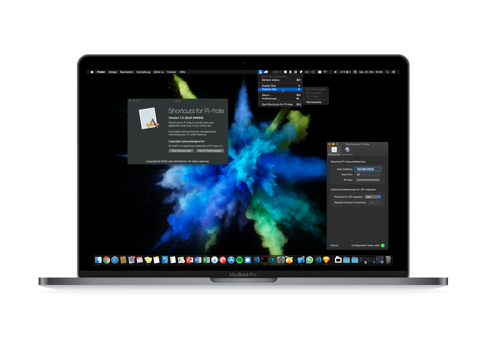
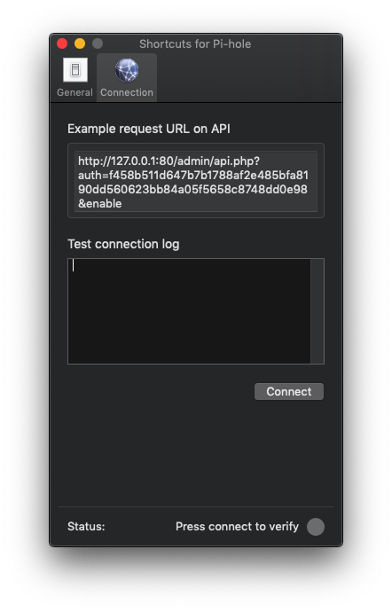

# Shortcuts for Pi-hole

Shortcuts for Pi-hole is a small menu bar application that lives in your status bar. It provides quick actions for managing and monitoring your Pi-hole® instance.

General Preferences     |  Connection Preferences
:-------------------------:|:-------------------------:
  |  

## Things to complete

- [ ] Implement Unit-/Testing
- [ ] Create as cask

## Copyright acknowledges and credits

Big thanks to the whole Pi-hole userspace for developing and maintaining the Pi-hole project. Visit [pi-hole.net](https://pi-hole.net/) for more information. This application uses the Pi-hole API and it's logo as menu bar icon.

**Pi-hole® is a registered trademark of Pi-hole LLC**

## Source code license

MIT License

Copyright (c) 2018 Lukas Wolfsteiner <lukas@wolfsteiner.media>

Permission is hereby granted, free of charge, to any person obtaining a copy
of this software and associated documentation files (the "Software"), to deal
in the Software without restriction, including without limitation the rights
to use, copy, modify, merge, publish, distribute, sublicense, and/or sell
copies of the Software, and to permit persons to whom the Software is
furnished to do so, subject to the following conditions:

The above copyright notice and this permission notice shall be included in all
copies or substantial portions of the Software.

THE SOFTWARE IS PROVIDED "AS IS", WITHOUT WARRANTY OF ANY KIND, EXPRESS OR
IMPLIED, INCLUDING BUT NOT LIMITED TO THE WARRANTIES OF MERCHANTABILITY,
FITNESS FOR A PARTICULAR PURPOSE AND NONINFRINGEMENT. IN NO EVENT SHALL THE
AUTHORS OR COPYRIGHT HOLDERS BE LIABLE FOR ANY CLAIM, DAMAGES OR OTHER
LIABILITY, WHETHER IN AN ACTION OF CONTRACT, TORT OR OTHERWISE, ARISING FROM,
OUT OF OR IN CONNECTION WITH THE SOFTWARE OR THE USE OR OTHER DEALINGS IN THE
SOFTWARE.
